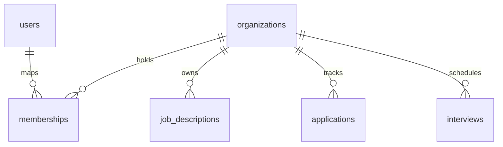

# ATS Architecture Documentation

This document describes the high-level architecture and data patterns of the **AI Automated Hiring Software**.

## 1. System Overview

The system is designed as a multi-tenant, role-based SaaS Applicant Tracking System (ATS). It follows a standard three-tier architecture:

```mermaid
graph TD
    Client[React Client (Vite)] -- "HTTPS (JSON API)" --> Server[Express Backend]
    Server -- "SQL Protocol" --> DB[(MySQL Database)]
```

### Components:
- **Frontend**: A single-page application built on React, Vite, and Bootstrap, using React Router for navigation and custom UI components.
- **Backend**: A RESTful API built on Node.js and Express. Handles business logic, authentication, AI orchestration, and audit logging.
- **Database**: A MySQL database storing users, jobs, candidates, applications, organizations, interviews, comments, and security audit trails.

---

## 2. Multi-Tenant Organization Isolation

The system uses a shared-database, shared-schema multi-tenant design. Tenant isolation is enforced through a membership-based ownership model:



### Isolation Patterns:
1. **Organization Reference**: Key entities (`job_descriptions`, `applications`, `interviews`, `activities`, `communications`) contain an `organization_id` column.
2. **Membership Scoping**: Users sign up and create or join an organization. Their membership details (organization and role) are encrypted within their JWT session tokens.
3. **Database Scoping**: All resource queries in backend controllers filter by the authenticated user's `organization_id`. For example:
   ```sql
   SELECT * FROM job_descriptions WHERE organization_id = ?
   ```
4. **Ownership Verification**: Before modifying, viewing, or deleting resources by ID, controllers invoke `verifyOwnership` hooks to assert that the resource's `organization_id` matches the user's active membership ID.

---

## 3. Core Modules & Data Flows

### A. Job Management System
- Handles job requisitions, drafting JDs, publishing, and public-facing job application boards.
- Candidates apply to specific job requisitions, which registers an applicant profile linked to the tenant's organization context.

### B. Applicant Tracking Pipeline & Kanban
- Tracks candidates through a canonical recruitment lifecycle: `Applied` -> `Screening` -> `Shortlisted` -> `Interview` -> `Hired` / `Rejected`.
- Real-time updates trigger notifications and log security audit events.

### C. AI Resume Matcher & Candidate Intelligence
- Computes matching scores by comparing resume text against job description criteria.
- Employs self-healing model updates to evaluate candidates on experience, technical skills, and behavioral fit.

### D. Security Audit Trails
- Appends security events (login success, login failure, role adjustments, cross-tenant violations) to the `audit_logs` table.
- Traps exceptions internally to prevent auditing failures from crashing user requests.
