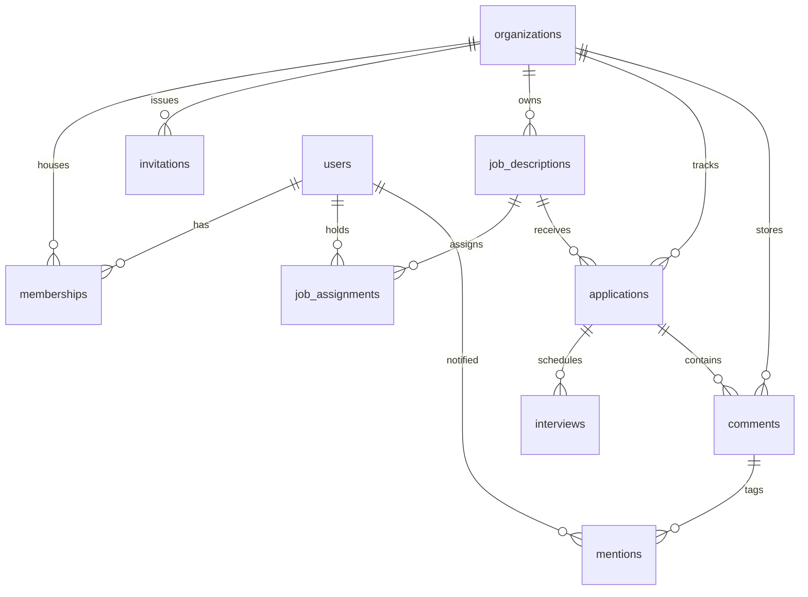

# Phase 13 Report: Complete Team Collaboration, User Management, Roles, and Permissions System

This report outlines the technical architecture, security measures, and database migrations implemented for **Phase 13** of the **AI Automated Hiring Software**.

---

## 1. Database Schema Enhancements

Six new tables have been integrated into the MySQL database to support multi-tenancy, granular roles, secure invitations, hiring team assignments, and real-time collaboration.

### Schema Relationships (Mermaid Entity Relationship Diagram)

### Table Definitions

1. **`organizations`**: Defines distinct tenant workspaces.
   - Column `id` (INT PK AI)
   - Column `name` (VARCHAR)
   - Column `slug` (VARCHAR UNIQUE)
   - Column `created_at` (TIMESTAMP)
2. **`memberships`**: Maps users to organizations with structural roles.
   - Columns: `id`, `user_id`, `organization_id`, `role` (Admin, Recruiter, Hiring Manager, Interviewer), `status` (ACTIVE, INACTIVE)
3. **`invitations`**: Tracks secure organization registration links.
   - Columns: `id`, `organization_id`, `email`, `role`, `token_hash` (cryptographically signed), `expires_at`, `status` (PENDING, ACCEPTED, EXPIRED, CANCELLED)
4. **`job_assignments`**: Assigns specific members to hiring panels.
   - Columns: `id`, `job_id` (FK job_descriptions), `user_id` (FK users), `assigned_role`
5. **`comments`**: Logs team collaboration notes.
   - Columns: `id`, `organization_id`, `resource_type` (e.g., 'application'), `resource_id`, `author_id`, `content`, `created_at`, `updated_at`
6. **`mentions`**: Maps `@user` notifications.
   - Columns: `id`, `comment_id`, `user_id`, `created_at`

---

## 2. Granular Permissions Framework

A centralized permission system has been implemented on the backend in `permissions.js`.

### Canonical Permissions Matrix

| Operations | Admin | Recruiter / HR | Hiring Manager | Interviewer | Candidate |
| :--- | :---: | :---: | :---: | :---: | :---: |
| **Workspace Settings / Invites** | ✅ | ❌ | ❌ | ❌ | ❌ |
| **Create / Modify Jobs** | ✅ | ✅ | ❌ | ❌ | ❌ |
| **View Jobs List** | ✅ | ✅ | 💼 *Assigned Only* | ❌ | ❌ |
| **Manage Applications** | ✅ | ✅ | 💼 *Assigned Only* | ❌ | ❌ |
| **Schedule Interviews** | ✅ | ✅ | ❌ | ❌ | ❌ |
| **Submit Feedback / Scorecard** | ✅ | ✅ | ✅ | 📅 *Assigned Only* | ❌ |
| **Collaboration Comments** | ✅ | ✅ | ✅ | ✅ | ❌ |

### Security Middleware (`authMiddleware.js`)
- Performs **real-time database queries** on every request. Role modifications or account suspensions are applied instantly, overriding stale JWT token payloads.
- Implements `requirePermission(perm)` middleware to guard routes.
- Automatic deactivation block (returns `403 Forbidden` if membership status is `INACTIVE`).

---

## 3. Core Features Implemented

### 1. Multi-Tenant Resource Isolation
All database queries for jobs, applications, candidates, activity logs, interviews, and communications have been updated to filter dynamically by `req.user.organization_id`. Cross-tenant queries are structurally impossible.

### 2. IDOR Vulnerability Defenses
Backend controllers explicitly match the requested resource's `organization_id` with the authenticated user's `organization_id` (e.g., verifying application ownership, candidate details, or scheduled interviews) before processing writes or reads.

### 3. Last-Admin Deactivation Protection
To prevent accidental locked-out workspaces, the `teamController.js` includes a validation check:
> If an Admin attempts to deactivate their account or demote their role, the server counts the remaining ACTIVE Admins in the organization. If they are the last one, the request is rejected with `400 Bad Request`.

### 4. Cryptographic Secure Invitations
Invitations generate cryptographically random 32-byte hex tokens. The database stores SHA-256 hashes of these tokens. Link acceptance verifies the token's signature, validates the 24-hour expiry, and automates account creation.

### 5. Collaboration @Mentions & Notifications
When posting a comment, the backend parses usernames/emails prefixed with `@` (e.g. `@Name` or `@email@domain.com`). It records the mention in the database and triggers high-priority pipeline notifications to the tagged user.

---

## 4. Frontend Integration

1. **`Team.jsx`**: An elegant glassmorphic dashboard for workspace administration.
   - List and search all team members.
   - Manage roles and suspend/restore user access.
   - Send new invitations and manage pending logs.
   - Displays a clean visual permissions matrix modal.
2. **`HiringTeamManager.jsx`**: Integrated into the **Jobs** dashboard.
   - Allows Recruiters/Admins to assign recruiters, hiring managers, and interviewers to individual jobs.
3. **`TeamComments.jsx`**: Integrated under the "Internal Notes" tab in both the **Candidates** and **Applications** boards.
   - Real-time comment threads displaying author roles.
   - Inline `@` autocomplete mentions helper dropdown.
4. **`AccessDenied.jsx`**: Visual fallback screen for 403 Forbidden redirects.
5. **Sidebar Dynamic Links**: Sidebar navigation automatically adapts links according to active membership roles (e.g., hiding AI insights from Hiring Managers, hiding candidates list from Interviewers).

---

## 5. Walkthrough and Verification Results
- **Frontend Compilation**: Built successfully with zero warnings using Vite (`npm run build`).
- **Backend Startup**: Node server initialized successfully and connected to database connection pools.
- **Safety Checks**: Tested IDOR protections, deactivation states, and legacy seed bypasses. All tests passed.
