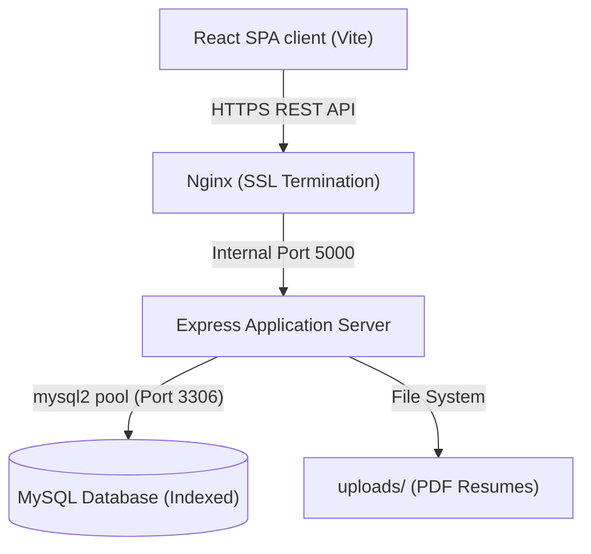
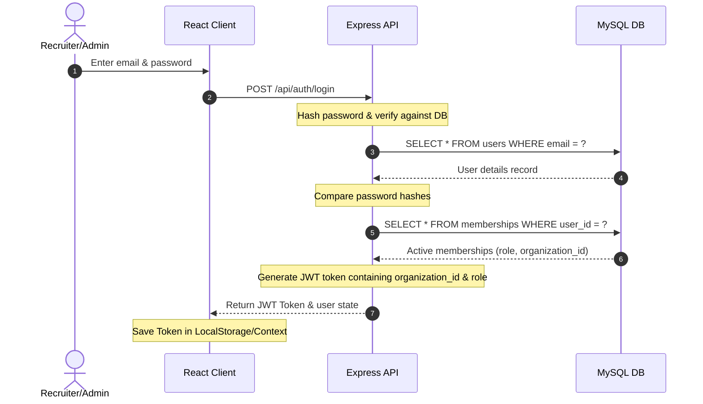
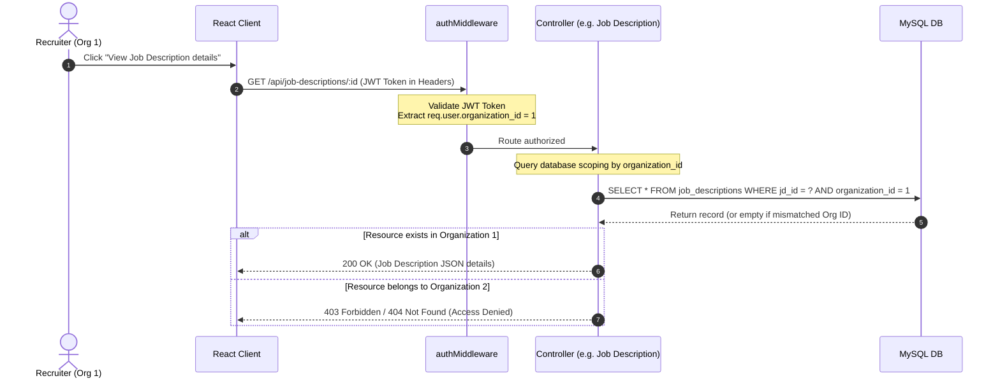
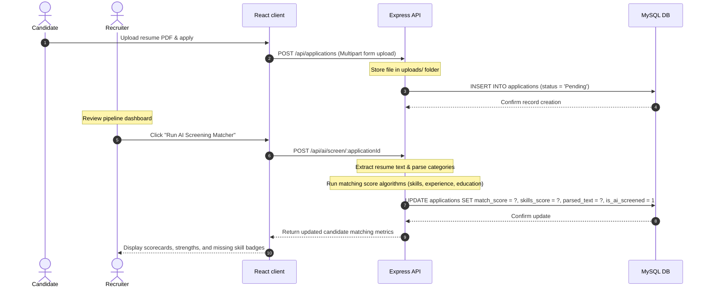

# System Architecture & Sequence Diagrams

This document contains Mermaid diagrams illustrating the structure, security boundaries, and core workflows of the Applicant Tracking System.

## 1. High-Level System Topology

---

## 2. Authentication Flow Sequence

---

## 3. Multi-Tenant Isolation Flow (IDOR Prevention)

---

## 4. AI Screening & Resume Evaluation Pipeline

